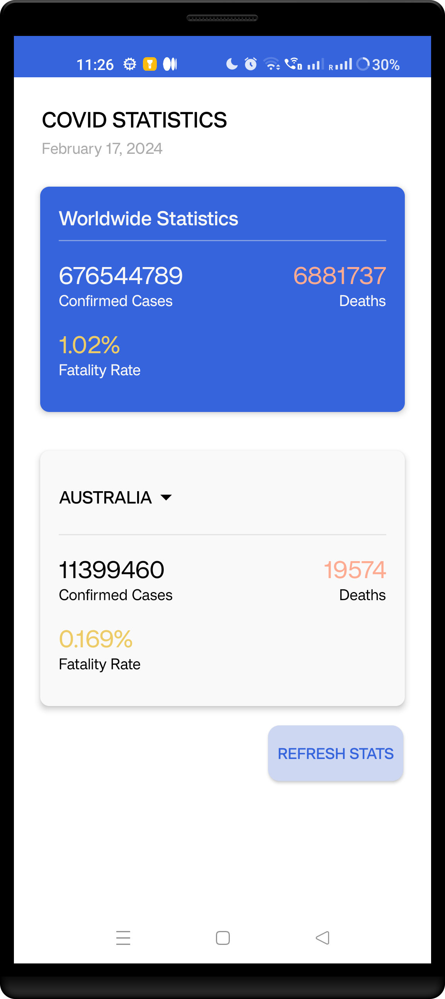
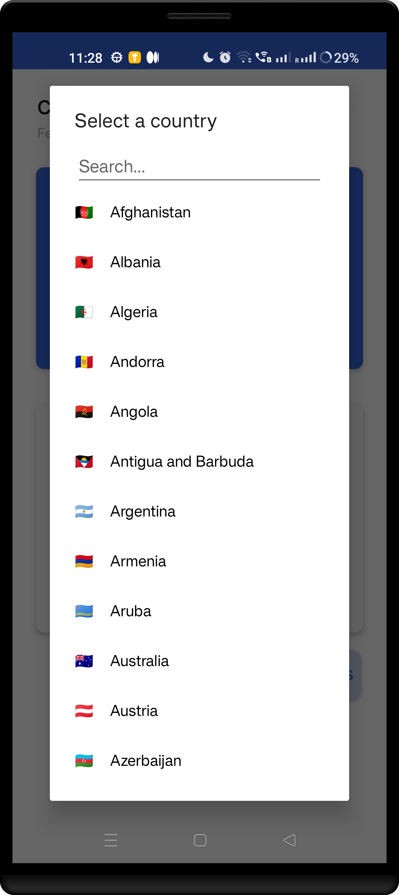

# Demo Android Application - Kotlin MVVM Covid App

Welcome to the Demo Android Application built with **Kotlin** and following the **MVVM** architecture! This app utilizes the **https://covid-api.com/ API** to fetch reports worldwide and region specific

## Features:

1. **Worldwide report:**
   - Users can see the worldwide covid report confirmed cases, deaths and fatality rate.

2. **Region Specific Report:**
   - The application dynamically shows report for the country Australia by default.

3. **Switch region:**
   - User can switch region and see the reports ofr all countries.

## Technology Stack:

- **Kotlin:** The modern and expressive programming language for Android development.
  
- **MVVM Architecture:** A design pattern that separates the app into three main components (Model, View, ViewModel), promoting clean and maintainable code.

- **https://covid-api.com/ API:** Seamless integration with the API for real-time and up-to-date data.

- **Other libraries used:** Coroutines, Dependency Injection (Hilt), View Binding, JUnit, Retrofit, AndroidCountryPicker

## Screenshots:

  
  

## Recording:

